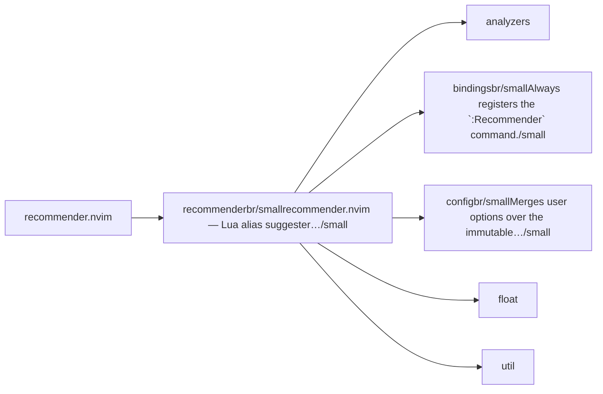
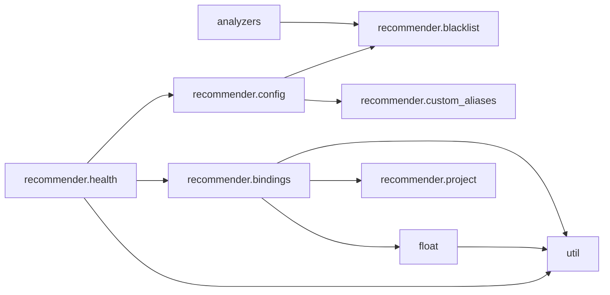

# recommender.nvim — module map

> **Generated** by `documentation`. Do not edit by hand — run `:DocMap`
> (or `nvim --headless -l scripts/gen_map.lua`) to regenerate.

**3 modules** · 4 namespaces · 19 helper files

The [interactive map](index.html) has filtering, full descriptions and
source links; this page is the version the code host renders directly.

## Namespaces

## Dependencies

Which parts of the tree require which, rolled up to the second level.
The [interactive map](index.html)'s **Deps** view has this per module,
in both directions, with load-time and lazy requires told apart.

## Modules

| Module | Description | Fns | Docs |
|---|---|---|---|
| `recommender` | recommender.nvim — Lua alias suggester for Neovim. | 1 | [src](../../lua/recommender/init.lua) |
| &nbsp;&nbsp;`analyzers` |  |  |  |
| &nbsp;&nbsp;`recommender.bindings` | Always registers the `:Recommender` command. | 1 | [src](../../lua/recommender/bindings/init.lua) |
| &nbsp;&nbsp;`recommender.config` | Merges user options over the immutable DEFAULTS and exposes the active config via `get()`. | 2 | [src](../../lua/recommender/config/init.lua) |
| &nbsp;&nbsp;`float` |  |  |  |
| &nbsp;&nbsp;`util` |  |  |  |

## Drift

0 errors · 0 warnings · 9 info

No errors or warnings.

9 informational findings

| Check | Message |
|---|---|
| `missing-readme` | lua/recommender has no README.md |
| `missing-readme` | lua/recommender/bindings has no README.md |
| `missing-readme` | lua/recommender/config has no README.md |
| `unreferenced-module` | recommender.@types is required by no other file in the tree |
| `unreferenced-module` | recommender.analyzers.javascript is required by no other file in the tree |
| `unreferenced-module` | recommender.analyzers.python is required by no other file in the tree |
| `unreferenced-module` | recommender.analyzers.regex is required by no other file in the tree |
| `unreferenced-module` | recommender.analyzers.treesitter is required by no other file in the tree |
| `unreferenced-module` | recommender.health is required by no other file in the tree |

